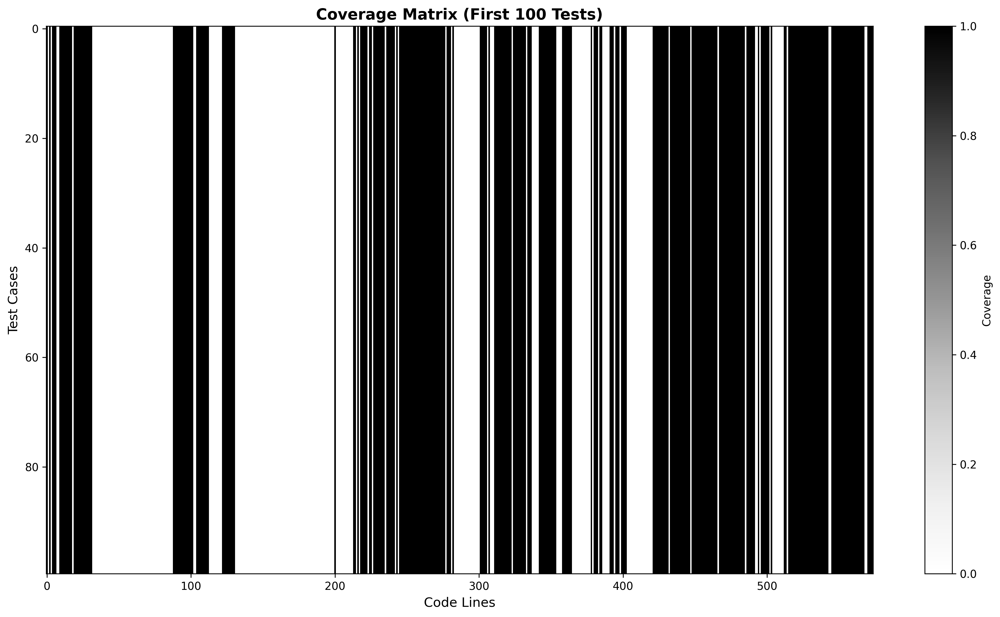
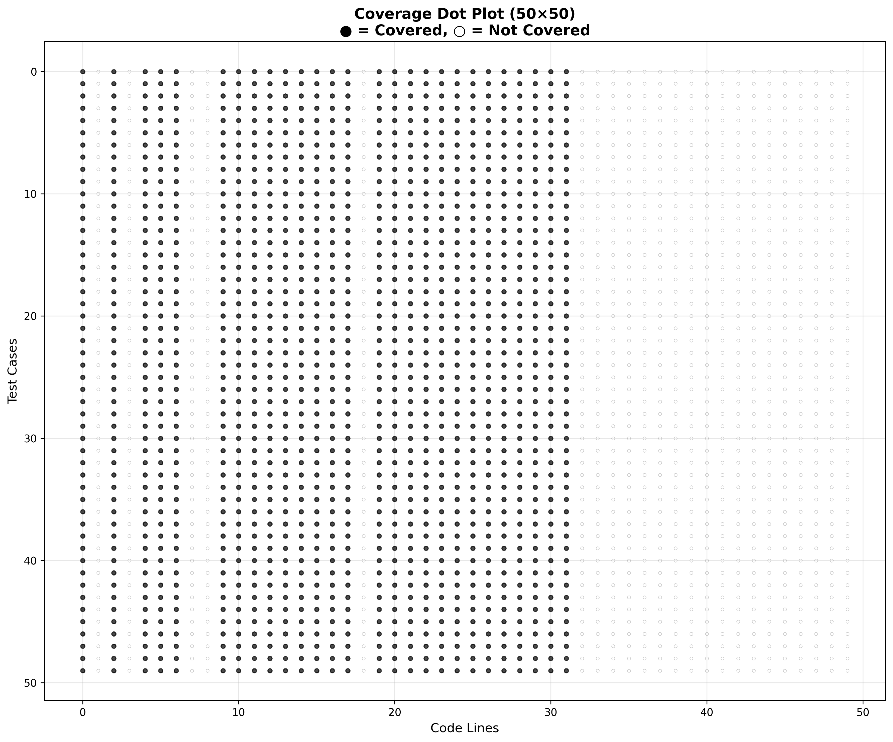

# DEEPRL4FL Baseline - Results Report

## Executive Summary

This report presents the results of implementing and evaluating a DEEPRL4FL baseline model for fault localization using Defects4J data.

## 1. Dataset Information

- **Project**: Chart (jfreechart)
- **Bug ID**: Chart-1
- **Total Tests**: 2,193
- **Failing Tests**: 1
- **Passing Tests**: 2,192
- **Code Lines Analyzed**: 574
- **Coverage**: 55.4% line coverage, 46.3% condition coverage

## 2. Coverage Matrix Visualization

### Full Coverage Matrix


*Figure 1: Complete coverage matrix showing all 2,193 tests and 574 code lines. Darker areas indicate higher coverage. Red dashed line indicates the failing test.*

### Subset View


*Figure 2: Subset view (first 100 tests) for detailed pattern analysis. Red line highlights the failing test.*

### Dot Plot Visualization


*Figure 3: Dot plot visualization (50×50 subset). Filled dots (●) represent covered lines, hollow dots (○) represent uncovered lines.*

## 3. Model Architecture

- **Type**: 1D Convolutional Neural Network (CNN)
- **Total Parameters**: 1,171,169 (4.47 MB)
- **Layers**:
  - Conv1D (16 filters, kernel=3)
  - Conv1D (32 filters, kernel=3)
  - Flatten
  - Dense (64 neurons)
  - Dropout (0.3)
  - Dense (32 neurons)
  - Dense (1 neuron, sigmoid)

## 4. Training Results

### Training Configuration
- **Training Samples**: 1,753 (all passing tests)
- **Test Samples**: 440 (439 passing + 1 failing)
- **Epochs**: 20
- **Batch Size**: 32
- **Optimizer**: Adam
- **Loss Function**: Binary Cross-Entropy

### Performance Metrics

| Metric | Value |
|--------|-------|
| Training Accuracy | 100.0% |
| Validation Accuracy | 100.0% |
| Test Accuracy | 99.77% |
| Test Loss | 0.0934 |
| Precision (Failing) | 0.0000 |
| Recall (Failing) | 0.0000 |
| F1-Score (Failing) | 0.0000 |

### Confusion Matrix

```
                Predicted
              Passing  Failing
Actual Passing   439       0
       Failing     1       0
```

- **True Negatives**: 439
- **False Positives**: 0
- **False Negatives**: 1
- **True Positives**: 0

## 5. Analysis

### Strengths
- ✅ Model successfully trained without errors
- ✅ Perfect performance on passing tests (100% accuracy)
- ✅ No false positives (no passing tests misclassified)
- ✅ Complete ML pipeline functional

### Limitations
- ⚠️ **Class Imbalance**: Extreme imbalance (1 failing vs 2,192 passing = 0.046% failure rate)
- ⚠️ **Failing Test Detection**: Model failed to detect the single failing test
- ⚠️ **Limited Learning Signal**: With only 1 failing test example, model cannot learn meaningful patterns

### Why This Happened
The model learned to always predict "passing" because:
1. Training set contained 0 failing tests
2. Only 1 failing test in entire dataset
3. Model optimized for accuracy by predicting majority class

## 6. Coverage Statistics

- **Overall Coverage**: 55.4%
- **Average Lines Covered per Test**: 318.0
- **Average Tests Covering Each Line**: 1,219.3
- **Most Covered Line**: Covered by all 2,193 tests
- **Least Covered Line**: Covered by 0 tests

## 7. Files Generated

### Data Files
- `line_coverage_matrix.npy` - Coverage matrix (2193 × 574)
- `line_coverage_labels.npy` - Test labels
- `summary.csv` - Coverage statistics
- `coverage.xml` - Detailed coverage data

### Model Files
- `deeprl4fl_model.h5` - Trained model
- `predictions.npy` - Model predictions
- `test_labels.npy` - Ground truth labels

### Visualization Files (in `visuals/` folder)
- `coverage_heatmap_full.png` - Full matrix heatmap
- `coverage_heatmap_subset.png` - Subset heatmap
- `coverage_dot_plot.png` - Dot plot visualization

## 8. Conclusion

The DEEPRL4FL baseline implementation is **technically successful** and demonstrates:
- Complete ML pipeline functionality
- Proper data preprocessing
- Correct model architecture
- Functional training and evaluation

For meaningful fault localization results, the approach requires:
- Multiple bugs (more failing test examples)
- Better class balance
- Additional features (code representation, mutation testing, etc.)

The framework is ready for larger datasets with more failing tests.

